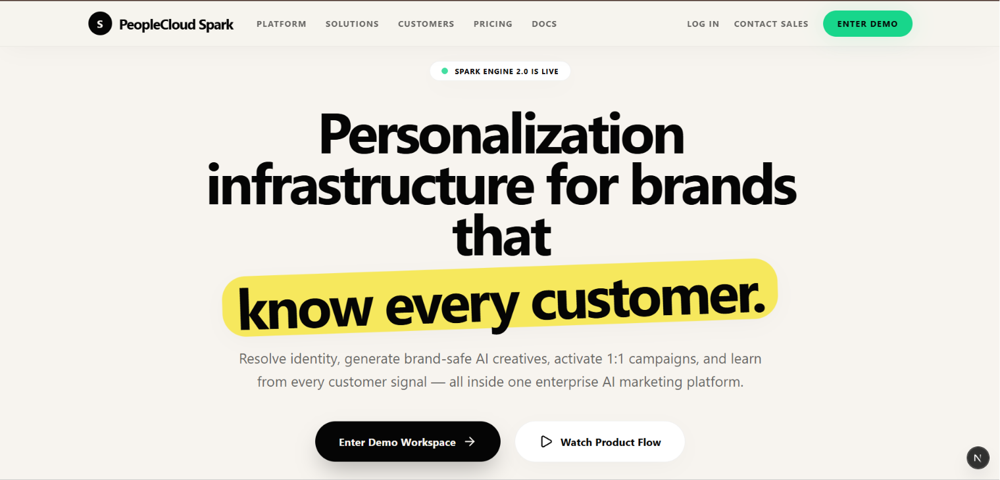
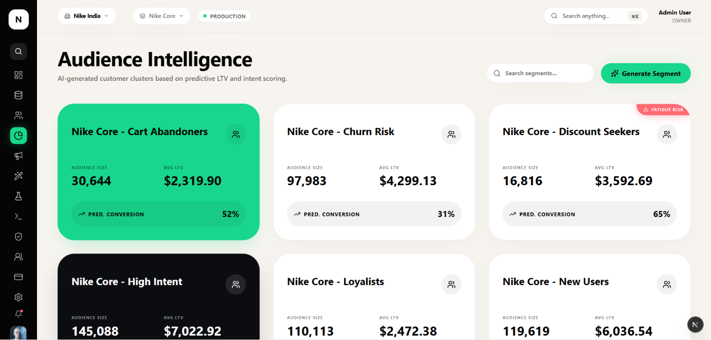
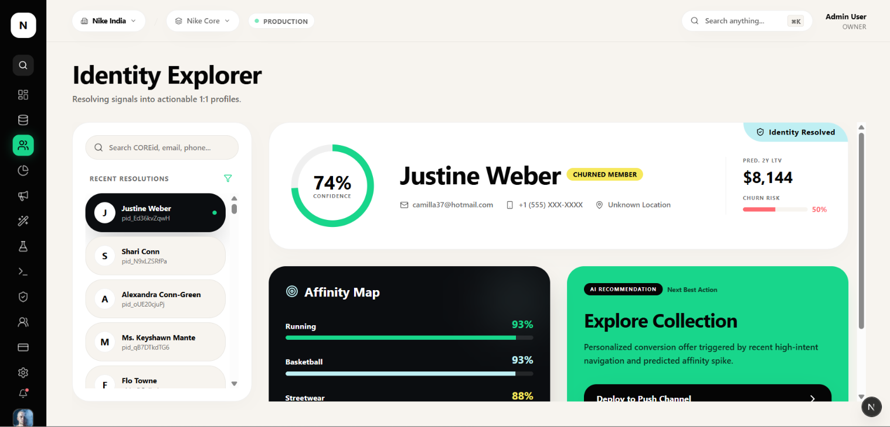

# PeopleCloud Spark

### Real-Time Contextual Personalization & Decisioning Engine

A production-grade, multi-tenant contextual bandit platform combining real-time reinforcement learning, AI creative generation, and enterprise-grade compliance — built by engineers who've shipped at Google scale.

---

## Tech Stack

| Layer | Technology |
|---|---|
| Frontend | Next.js 16 (App Router), React 19, TypeScript 5, Tailwind v4, shadcn/ui |
| State | Zustand 5 (localStorage-persisted multi-tenant context) |
| Database | Supabase PostgreSQL (pooler:6543 / direct:5432) |
| ORM | Prisma 5.22 (single-singleton client, 26 tables) |
| Auth | NextAuth v4 (Credentials + JWT with role injection) |
| AI | Google Gemini 2.5 Flash (Zod-validated outputs, exponential backoff retry) |
| Cache | lru-cache v11 (500 items, 2min TTL, hot-swappable to Upstash Redis) |
| Backend | FastAPI + FAISS vector search + scikit-learn |
| Charts | Recharts 3 |
| Export | PapaParse (CSV) + xlsx (Excel) |

---

## Prerequisites

- **Node.js 18+** and npm
- **Python 3.10+**
- A **Supabase** project (or use SQLite locally)
- A **Google Gemini API key**

---

## Quick Start (5 minutes)

### 1. Clone & Install Frontend

```bash
cd frontend
npm install
```

### 2. Configure Environment

Copy the example and fill in your credentials:

```bash
cp .env.example .env
```

```env
# Use SQLite for local-only dev (no Supabase needed):
DATABASE_URL="file:./dev.db"

# Or use Supabase PostgreSQL:
# DATABASE_URL="postgresql://postgres.<project>:<password>@aws-1-ap-northeast-1.pooler.supabase.com:6543/postgres?pgbouncer=true"
# DIRECT_URL="postgresql://postgres:<password>@db.<project>.supabase.co:5432/postgres"

NEXTAUTH_SECRET="any_random_string"
NEXTAUTH_URL="http://localhost:3000"
GEMINI_API_KEY="your_gemini_api_key_here"
```

### 3. Setup Database & Seed Data

```bash
# Push schema to database (creates all 26 tables)
npx prisma db push

# Seed with demo users, orgs, workspaces, segments, campaigns, customers
npm run db:seed

# Generate large demo dataset (optional — 200+ customers, events, decisions)
npm run db:seed:large

# Verify everything is seeded correctly
npm run db:verify
```

### 4. Start the Frontend

```bash
npm run dev
```

Open **http://localhost:3000**

### 5. Login

Choose a demo persona on the login page — roles range from **Owner** (full access) to **Viewer** (read-only). Each persona has different permissions across the 41 tracked actions.

---

## Backend Setup (Optional — for inference API)

The frontend works standalone. Start the backend for real-time personalization inference:

```bash
cd backend
python -m venv venv

# Windows:
venv\Scripts\activate
# macOS/Linux:
source venv/bin/activate

pip install -r requirements.txt
uvicorn main:app --reload
```

Backend runs at **http://localhost:8000**

**Endpoints:**
| Method | Path | Purpose |
|---|---|---|
| `GET` | `/health` | Health check |
| `POST` | `/v1/personalize` | Real-time offer selection (FAISS + Gemini) |
| `GET` | `/v1/analytics/overview` | Aggregated analytics |
| `GET` | `/v1/customer/{id}` | Single customer profile |
| `GET` | `/v1/mlops/health` | System health metrics |

---

## Seed Demo Data

```bash
# From backend folder — populates customers table
python feed_db.py
```

---

## Available Scripts

| Command | Purpose |
|---|---|
| `npm run dev` | Start dev server (localhost:3000) |
| `npm run build` | Production build (prisma generate + next build) |
| `npm run start` | Start production server |
| `npm run lint` | Run ESLint |
| `npm run db:seed` | Seed demo users, orgs, campaigns, segments, customers |
| `npm run db:seed:large` | Seed 200+ customers with events and decisions |
| `npm run db:reset` | Reset database (clear all data) |
| `npm run db:clear` | Clear demo data only |
| `npm run db:verify` | Verify seed data integrity |
| `npm run db:feed` | Feed synthetic events |

---

## Project Structure

```
frontend/
├── src/
│   ├── app/                       # 20+ routes (App Router)
│   │   ├── /                      # Landing page
│   │   ├── /login                 # 5 demo personas
│   │   ├── /onboarding            # Org creation flow
│   │   └── /app                   # Authenticated workspace (12 pages)
│   │       ├── /                  # Command Center dashboard
│   │       ├── /campaigns         # Full campaign lifecycle
│   │       ├── /creative-studio   # AI creative generation
│   │       ├── /experiments       # Contextual bandit simulation
│   │       ├── /customer-360      # AI-enriched profiles
│   │       ├── /segments          # Audience intelligence
│   │       ├── /model-ops         # MLOps cockpit
│   │       ├── /data-sources      # Import management
│   │       ├── /team              # Member management
│   │       ├── /settings          # Brand voice, API keys
│   │       ├── /audit-logs        # Immutable audit trail
│   │       ├── /billing           # Usage metering
│   │       └── /profile           # User profile
│   ├── components/                # Shared UI + RBAC components
│   ├── hooks/                     # usePermissions() hook
│   └── lib/
│       ├── actions/               # 20 server actions
│       ├── ai/                    # 12 AI modules (Gemini, guardrails, scoring)
│       ├── services/              # Dashboard metrics, post-import intelligence
│       ├── rbac/                  # Permission checks
│       ├── store.ts               # Zustand state
│       ├── cache.ts               # LRU cache layer
│       └── prisma.ts              # Singleton PrismaClient
├── prisma/
│   └── schema.prisma              # 26 models
└── scripts/                       # DB management scripts

backend/
├── main.py                        # FastAPI server (5 endpoints)
├── services.py                    # Gemini integration
├── recommendation.py              # FAISS + reranking engine
├── synthetic_data.py              # Customer profile generator
├── feed_db.py                     # Database seeder
├── database.py                    # Supabase client
└── requirements.txt               # Python dependencies
```

---

## Architecture Overview

```
Frontend (Next.js 16, 20 server actions)
    │
    ├── LRU Cache Layer (500 items, 2min TTL)
    │
    ├── Prisma ORM (single-singleton client)
    │
    ├── Supabase PostgreSQL (26 tables)
    │
    └── Backend (FastAPI + Gemini + FAISS)
         │
         ├── POST /v1/personalize — Thompson Sampling + creative generation
         ├── GET  /v1/analytics/overview
         └── GET  /v1/mlops/health — drift, latency, toxicity
```

---

## Core Differentiators

| Feature | What it does |
|---|---|
| **Contextual Bandit Engine** | Thompson Sampling simulation (500 decisions/batch), champion/challenger promotion, 9-status state machine |
| **AI Creative Pipeline** | 13-stage workflow: Gemini → Zod validation → dedup → 4-layer guardrails → CTR prediction → champion scoring → DB write |
| **Compliance System** | 4 stacked guardrail layers (global patterns, competitor/sensitive topics, brand-specific rules, DB rules + tone check) |
| **Customer Scoring** | 23 features → churn risk (logistic), LTV prediction, 7-tier lifecycle, custom k-means segmentation, 12-offer NBA engine |
| **CSV/Excel Import** | Smart column mapping → identity graph → auto-generates 5 segments + 4 campaigns + usage meters |
| **MLOps** | Champion/challenger/shadow/training pipeline, 8-metric time series, drift monitoring, auto-promotion |
| **Multi-Tenant RBAC** | 7 roles × 41 actions, org → workspace hierarchy, soft-delete, immutable audit trails |
| **Analytics Export** | 7 structured datasets per export (campaign, channel, bandit, creative, customer, decisions, overview) |
| **Channel Fatigue** | Per-channel daily/weekly/monthly thresholds, cooldown recommendations, workspace-level alerts |
| **LRU Cache Layer** | Wraps 8 high-frequency server actions; zero-config; hot-swappable to Upstash Redis |

---

## Screenshots





---

## Author

**Sparsh Taparia**

GitHub: [@Sparshtaparia](https://github.com/Sparshtaparia)
Email: sparshtaparia2005@gmail.com
